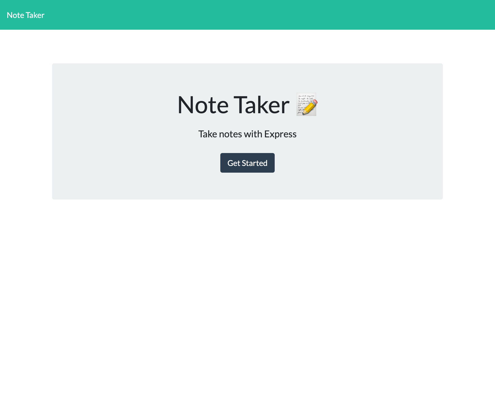
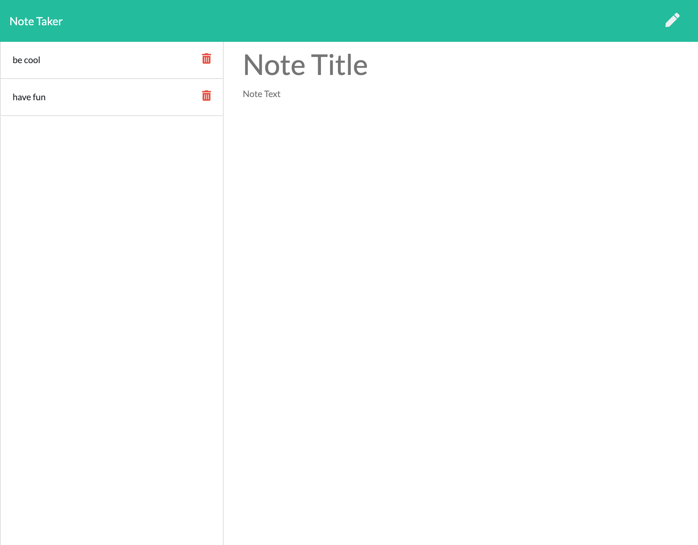

  # Note Taker
  

  ## Description
  This is an easy-to-use online note-taking application utilizing Express.js. [Click Here](https://frozen-eyrie-52480.herokuapp.com/) to check it out!

  ## Table Of Contents
  * [Installation](#installation)
  * [Usage](#usage)
  * [License](#license)
  * [Contribution](#contribution)
  * [Questions](#questions)

  ## Installation
  Please download the files located in the [repository](https://github.com/kristinmoon/note-taker) to utilize this Note Taker for personal use.

  ## Usage
  Get a feel for the application in the below screenshots...
  
  
  ## License
  This application is covered under: WTFPL

  ## Contribution
  I always welcome any suggestions you may have to improve my projects' functionality. This project is a work in progress. Please see below for how to contact me.

  ## Questions
  Please contact me at [kristin@icloud.com](mailto:kristin@icloud.com) with any questions. You can also find me on GitHub, username [kristinmoon](https://github.com/kristinmoon).
